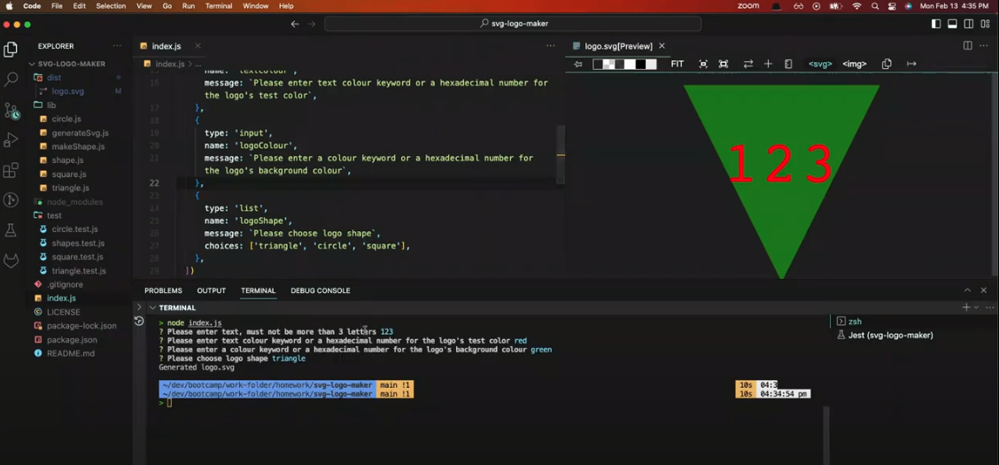

# SVG LOGO MAKER
Description:

The application enables users to enter inputs into a inquirer prompt in order to generate a logo "logo.svg" file which contains the users desired results as an SVG image.

Overview

The Challenge:

Build a Node.js command-line application that takes in user inputs to generates a SVG logo and saves it as "logo.svg" file. In addition, create a walkthrough video that demonstrates its functionality and the passing of all of the tests.

```
Acceptance Criteria:

GIVEN a command-line application that accepts user input
WHEN I am prompted for text
THEN I can enter up to three characters
WHEN I am prompted for the text color
THEN I can enter a color keyword (OR a hexadecimal number)
WHEN I am prompted for a shape
THEN I am presented with a list of shapes to choose from: circle, triangle, and square
WHEN I am prompted for the shape's color
THEN I can enter a color keyword (OR a hexadecimal number)
WHEN I have entered input for all the prompts
THEN an SVG file is created named `logo.svg`and the output text "Generated logo.svg" is printed in the command line
WHEN I open the `logo.svg` file in a browser
THEN I am shown a 300x200 pixel image that matches the criteria I entered
```

Installation:

In the root directory you want to run "npm i" to install all the required packages.

Usage:

<!--  -->

Walk Through Video

[](https://github.com/ManinderManan/10_Logo_Maker)

Tests

Its been tested for correct user input, logo text must not exceed 3 characters and must contain atleast 1 character.

It must be a vaild CSS named value or hex code to set the text colour of the logo and the background colour of the logo.

These tests must be passed in order for the logo.svg file to be generated.

Website:

https://github.com/ManinderManan/10_Logo_Maker